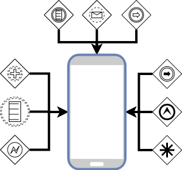

# Ana Modeller



Proje gelişim sürecinde gerekliliği tartışılabilir ama dünden bugüne okuduğum ve araştırdığımda bir çok faydasını gördüğüm bir yapı burada bizimle olacak.

Birincisi ben sayfalarımı türetirken ana state üzerinden değil base state üzerinden türeterek onlara temel özellikler kazandırıyorum.

```dart
abstract class BaseState<T extends StatefulWidget> extends State<T> {
  ThemeData get themeData => Theme.of(context);
  }
```

Ve bir sayfa tanımlarken **\_HomeView extends State** değil **extends BaseState** yaparak bu özellikleri doğrudan ona tanımlamış oluyorum.

> Bu kısıma siz istediğiniz kadar özellik verebilirsiniz burada ekranların kullanacağı temel yapıları tanımlamak elinizi çok rahatlacaktır.

Peki sayfalarımızı düşünecek olursak neden [statefull](https://www.youtube.com/watch?v=6baZbJiIuiQ) veya [stateless](https://www.youtube.com/watch?v=ZkP7QgLaZcY) derseniz onları ilgili içeriklerden inceleyebilirsiniz. Biz bir sayfa yaptığımızda genelde statefull gideriz ama büyük projelerde tüm sayfaları yönetecek bir katmana ihtiyacımız olabilir orada baseview yapısını kurguluyoruz.Bu yapıyla artık kullanacağımız **ViewModel**'i de özellikle istiyoruz ki sayfaya güç ve güvenide vermiş oluyoruz.

> Bu yapı özellike bir projede; eğer internet yoksa tüm ekranlarda ana bir popup göstermem gerektiği durumda çok fazla işime yaradı.
> Peki bu ana katmana bakacak olursak;

```dart
class BaseView<T extends Store> extends StatefulWidget {
  final Widget Function(BuildContext context, T value) onPageBuilder;
  final T viewModel;
  final Function(T model) onModelReady;
  final VoidCallback onDispose;
    const BaseView({Key key, @required this.viewModel, @required this.onPageBuilder, this.onModelReady, this.onDispose})
      : super(key: key);

  @override
  _BaseViewState<T> createState() => _BaseViewState<T>();
}
```

- İlk satırda kullanıcıdan Store(Mobx yazısı veya dersinde göreceksiniz) istiyoruz ve adama geri dönderip ekranını çizmesini istiyorum.
- İkinci satırda viewModel katmanını tanımlaması için istiyorum bu iki kısmı **@required** ile işaretliyorum ki vermek zorunda olsun.
- Son kısım ise sayfadan çıktığında bir şey yapmak isterse burada çağrıması için.

Ve bu yapıdan türeyen bir örnek yapmak istediğimizde;

```dart
  @override
  Widget build(BuildContext context) {
    return BaseView<LoginViewModel>(
      viewModel: LoginViewModel(),
      onModelReady: (model) {
        model.setContext(context);
        model.init();
        viewModel = model;
      },
      onPageBuilder: (BuildContext context, LoginViewModel value) => buildScaffold(context),
    );
  }
```

Biz hem sayfa açılınca yapılacak kısımları tanımlamış olduk. Hem bu ekranın çizimi için gereken katmanı hazırlayıp viewModel nesnemizi alt birimlerine verme imkanı edindik.

- Güç ✅ (Tüm sıfınlar bildiğimz bir katmandan türüyor)
- Çeviklik ✅ (Vereceğimiz yeni özelliklere doğrudan erişebilme.)
- Kontrol ✅ (ViewModel katmanımız olsun dispose katmanımız olsun daima ilgili yapılardan türeyip almak zorunda.)

!> Burada sayfayı yaparken BaseView kullandığınız için illaki StateFull yapmanıza gerek yok stateless bir widget yaparak baseview içindeki viewmodel objesini ilgili functionlar ile servis edip değişikliği [mobx](https://www.youtube.com/watch?v=1_vqvdqTjP8) katmanında yapabilirsiniz.

Ve ana modelimizde hazır daha fazlası için 🥳
[](https://www.youtube.com/watch?v=crKJEBxyxS8&list=PL1k5oWAuBhgV_XnhMSyu2YLZMZNGuD0Cv&index=2)
