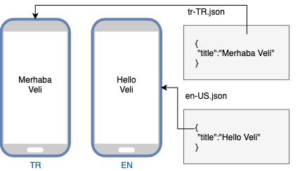

# Çoklu Dil Desteği ve Anlık Dil Değişimi



Bir çok uygulamanın artık olmazsa olmaz noktalarından birisidir. Özellikle ingilizce desteği çok önemli bir yer tutmakta. Önceden dil desteği gibi işlemler için kendi yapımı kullanırdım ama [easy localization](https://pub.dev/packages/easy_localization) paketi son haliyle bir çok konuda bu kısmı çözüyor.

> Paketin kullanımı oldukça kolay ama yinede dikkat etmeniz gereken noktalar ve bir kaç script ile işinizi kolay yolla çözmeyi inceleyelim.

Proje ilk başlarken runApp kısmında EasyLocalization ile sarmalamamız gerekiyor.

```dart
  child: EasyLocalization(
      child: MyApp(),
      supportedLocales: LanguageConstants.instance.supportedLocales,
      fallbackLocale: LanguageConstants.instance.trLocale,
      path: AppConstants.ASSETS_LANG_PATH,
    ),

    class MyApp extends StatelessWidget {
  @override
  Widget build(BuildContext context) {
    return MaterialApp(
      localizationsDelegates: context.localizationDelegates,
      supportedLocales: context.supportedLocales,
      locale: context.locale,
    )}}
```

- LanguageConstants sınıfımı özel olarak yapıp içine tr ve en paketlerini ekliyorum
  Örneğin trLocale = Locale("tr","TR);
- FallBack locale kısım ise projenin ana dilini belirlemek için kullanıyoruz bazı projeler de sadece tr istenebiliyor ondan ben bu şekilde bir örnek yaptım.
- Path kısmı benim tr ve en jsonlarımı sakladığım kısımın adresidir.(Kendisi bir otomatik adress atıyor fakat ben yazdığım script ile istediğim yerde konumlandırıyorum.)

Örnek kulalnımda ise;

!> Extension kullanmak istersek EasyLocalization yazıp import pathini ekliyoruz

```dart
Text(LocalaKeys.sample_title.locale).tr()
//veya kendi yazacağınız StringExtension ile bu gücü kazanabilirsiniz.
Text(LocalaKeys.sample_title.locale)
```

Değiştirmek için ise çok basitçe;

```dart
context.locale = Locale('en', 'US');
```

Burada oluşturacağımız tr ve en json dosyaları için şu şekilde bir sh script hazırladım sizde rahatlıkla bunu kullanbilirsiniz.

```sh
flutter pub run easy_localization:generate  -O lib/core/init/lang -f keys -o locale_keys.g.dart --source-dir assets/lang
```

Oluştacağımız json dosyalarının içine herhangi bir key value koyup ardından bu scripti çağırarak doğrudan kodları üretmiş oluyoruz.


Özellikle projelerimde genelde ingilizce devam ediyorum ama gün sonunda tr de gerektiğinde tüm seçili jsondaki valuleri seçip [vscode daki converter](https://marketplace.visualstudio.com/items?itemName=funkyremi.vscode-google-translate) extensionu ile istediğim dile çevirebilirsiniz.

Burada valueleri seçmek için şu şekilde bir regex yapıyorum ve sadece değerleri seçebiliyorum.

> (: ")(.\*?)(?:")


Ve artık hem çoklu dil desteğimiz tek dokunuş ile hazır, hemde çalışma zamnınında değişiklik yapabiliyoruz.

Ve ana modelimizde hazır daha fazlası için 🥳
[](https://www.youtube.com/watch?v=jQ8JuX5RpNc&list=PL1k5oWAuBhgV_XnhMSyu2YLZMZNGuD0Cv&index=4)
